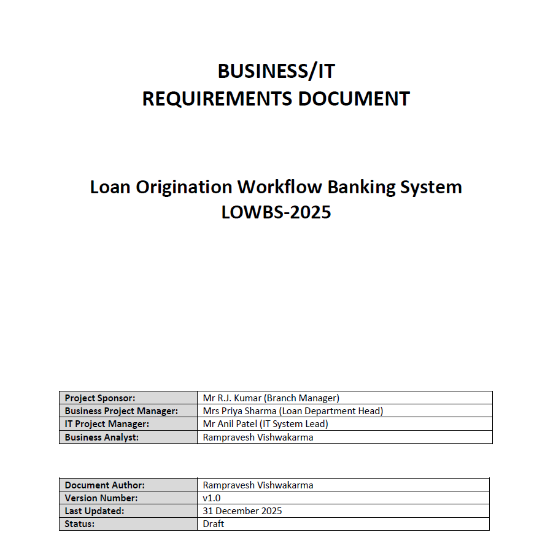
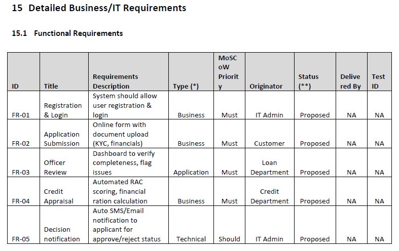
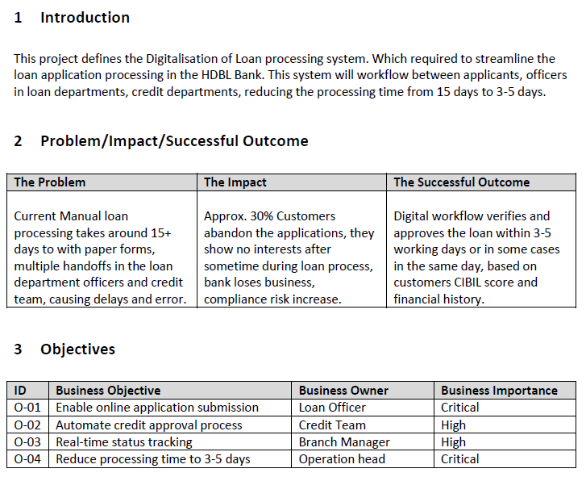
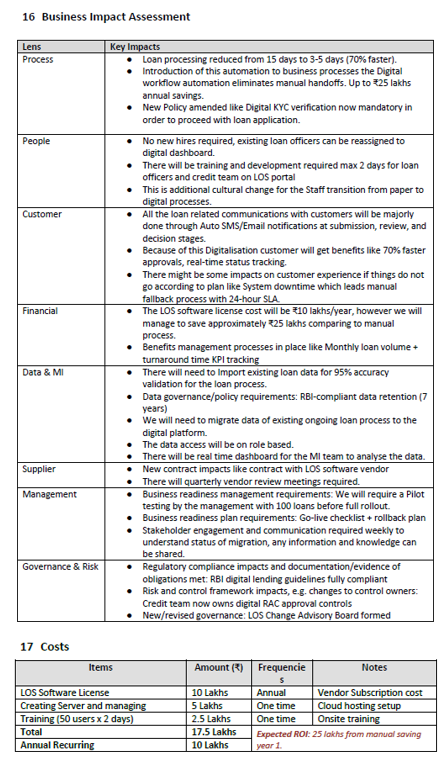

# Loan Processing System BRD

## Overview
This project presents a Business Requirements Document (BRD) for digitizing a loan origination workflow in a banking environment. It focuses on reducing manual processing delays, improving customer experience, and enabling faster approvals through a structured digital workflow.

## Problem Statement
The existing loan process is manual, paper-based, and dependent on multiple handoffs between applicants, loan officers, and credit teams. This creates delays, increases error risk, and leads to customer drop-offs during the application journey.

## Objectives
- Enable online loan application submission
- Automate credit appraisal workflow
- Provide real-time status tracking for stakeholders
- Reduce loan processing time from 15 days to 3–5 days

## Tools & Techniques
- Business Requirements Documentation
- Functional Requirements (FR)
- Non-Functional Requirements (NFR)
- Scope Definition
- Risk and Dependency Analysis
- Business Impact Assessment

## Scope
### In Scope
- User registration and login
- Application submission with document upload
- Officer review dashboard
- Credit appraisal and decision workflow
- SMS/Email notifications

### Out of Scope
- Loan servicing
- Collections
- Payment processing

## Methodology
1. Defined the current-state problem and business impact
2. Identified stakeholders and project objectives
3. Created scope, assumptions, risks, and dependencies
4. Documented high-level and detailed business requirements
5. Added functional and non-functional requirements
6. Included business impact, cost estimate, and ROI view

## Key Insights
- Manual loan processing creates delays and increases compliance risk
- A digital workflow can reduce turnaround time significantly
- Real-time tracking and automated notifications improve customer experience
- Structured requirement documentation supports stakeholder alignment and future solution design

## Recommendations
- Pilot the solution with a limited loan volume before full rollout
- Prioritize KYC, credit bureau, and notification integrations early
- Track business KPIs such as turnaround time, abandonment rate, and approval cycle duration

## Repository Structure
- `docs/` – BRD PDF
- `assets/` – process screenshots or diagrams
- `notes/` – summary notes and stakeholder overview

## Outcome
This project demonstrates business analysis capability in documenting scope, requirements, risks, non-functional expectations, and business impact for a banking workflow transformation.

## Assets

## Author
Rampravesh Vishwakarma  
Business Analyst
